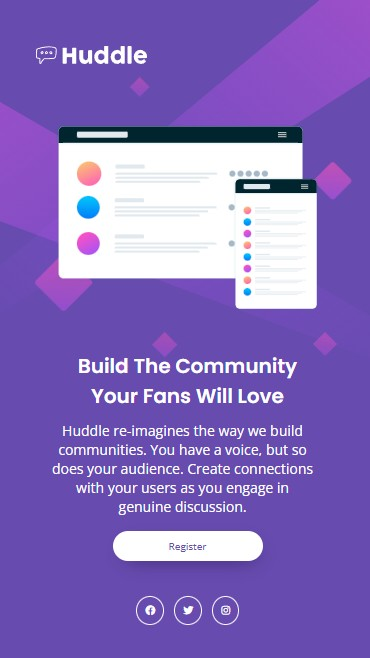

# Huddle Landing Page with Single Introductory Section

This project is a solution to the **Huddle landing page** challenge from [Frontend Mentor](https://www.frontendmentor.io/). The goal was to build a responsive landing page that looks as close to the provided design as possible — for both mobile and desktop screens.

## Project Preview

## 📱 Responsive Design

The page was built using the **mobile-first** approach, which made the responsive layout easier to manage and implement. The layout adapts gracefully from small mobile screens to large desktop widths.

## 🔨 Technologies Used

- Semantic **HTML5** markup
- **CSS Flexbox** for layout
- **CSS Custom Properties** (variables)
- **CSS Media Queries** for responsiveness

## 💡 What I Learned

This was my **second attempt** at the challenge — the first time didn’t go as planned, but this time I’m proud of the result! I learned how effective and smooth mobile-first development can be when building responsive interfaces.

## 🚀 Live Preview

[Add your live site link here, if you have one — like GitHub Pages or Netlify]